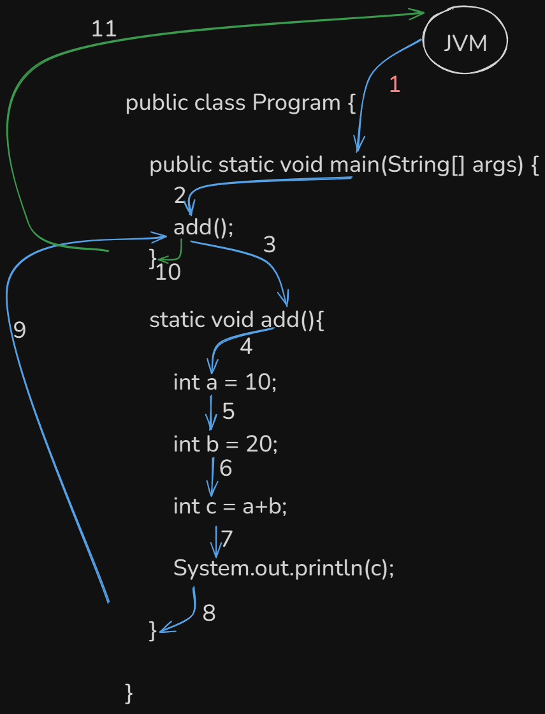
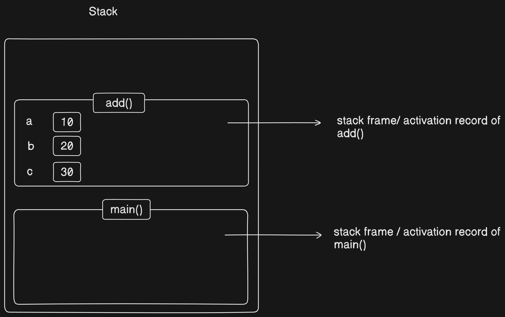

# JRE

## JRE (Java Runtime Environment)


### Definition
JRE is the **space where a Java program runs (gets executed)**. It provides the **environment necessary to run Java applications**.


### What does JRE contain?

- **JVM (Java Virtual Machine)** – The engine that runs Java bytecode  
- **Libraries and Class Files** – Predefined Java libraries required to run programs  
- **Other Supporting Files** – Configuration and runtime tools  


### Purpose

- JRE does **not compile code** — it only runs already compiled Java programs (`.class` files).
- It ensures your program runs **consistently** on any system that has JRE installed.


### Summary

> JRE is like a **stage** where your Java play (program) is performed.  
> It doesn’t write the play — it just performs it.

### Flow

```
public class Program {
    public static void main(String[] args) {
        add();
    }
    static void add(){
        int a = 10;
        int b = 20;
        int c = a+b;
        System.out.println(c);
    }
}

```




### What Happens When a Method is Called?

Whenever a method is called in Java:

- A **stack frame** (also called an **activation record**) is created in the **stack segment** of memory.
- This stack frame holds all the information required for the method's execution.
- When the method execution is completed, its stack frame is **removed** (popped) from the stack.


### Stack Frame (Activation Record)

- A **stack frame** is a **block of memory** that is allocated **on the stack segment**.
- It stores:
  - Local variables
  - Return address
  - Parameters
  - Temporary data used during method execution


### Local Variables

- **Local variables** are the variables declared **inside a method**.
- Their memory is allocated **within the method's stack frame**.
- These variables are **accessible only during the method's execution** and are destroyed once the method ends.





```
import java.util.Scanner;

public class RemainderCalculator {

    // Method to calculate remainder
    public static double findRemainder(double num1, double num2) {
        return num1 % num2;
    }

    public static void main(String[] args) {
        Scanner sc = new Scanner(System.in);

        // Input two double numbers
        System.out.print("Enter first number: ");
        double a = sc.nextDouble();

        System.out.print("Enter second number: ");
        double b = sc.nextDouble();

        // Call the method to find remainder
        double result = findRemainder(a, b);

        // Output the result
        System.out.println("Remainder: " + result);

        sc.close();
    }
}


```