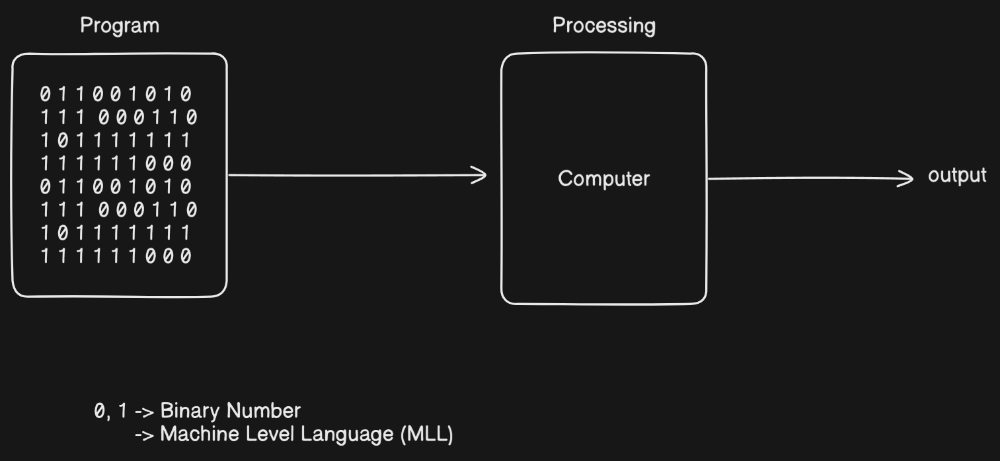
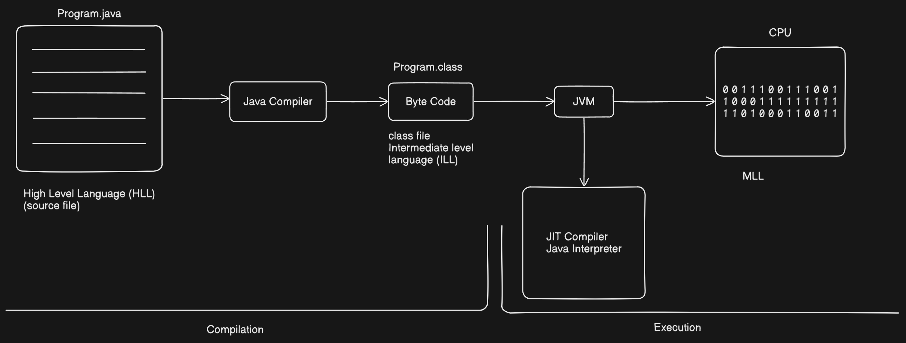
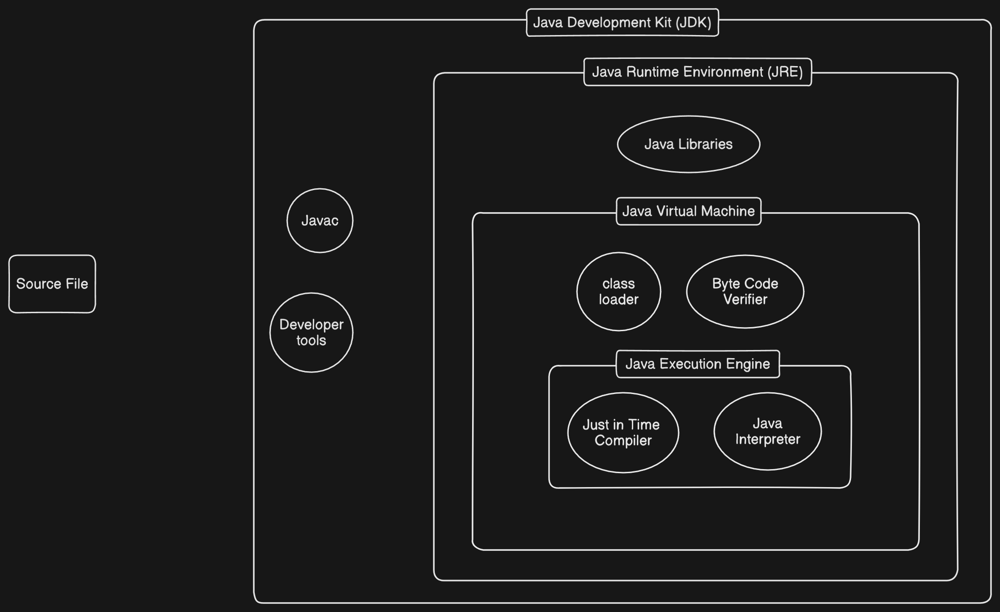

# SDLC (Software Development Lifecycle)

## Software Testing Overview

### Manual Testing
Manual testing is the process of testing the software manually without using any automated tools or scripts. Testers execute test cases by hand to identify bugs or issues.

### Automation Testing
Automation testing is the process of testing the software using automation tools or scripts, such as Selenium, to execute test cases faster and more efficiently.

---

## Software Development Life Cycle (SDLC)

The SDLC consists of several stages used to develop high-quality software:

### 1. Requirement Collection and Analysis

- Collecting and analyzing what the user needs.
- Requirements should be:

  * **Unambiguous**: No confusion in understanding.
  * **Feasible**: Possible to achieve within resources.
  * **Complete**: All necessary features included.
  * **Consistent**: No contradictions; the first day’s requirement should match the last day’s requirement.

### 2. Design

This stage focuses on how the software will be structured.

* **High-Level Design (HLD)**:

  * Architecture design, module definition.
  * Flowcharts and block diagrams.
* **Low-Level Design (LLD)**:

  * Detailed design for individual components or modules.

### 3. Development

* The actual **programming** or coding phase.
* Converts design documents into executable software using programming languages.

### 4. Testing

* Software is tested to ensure it meets the requirements.
* Ensures the product is **testable** and functions correctly.
* Types of testing include unit testing, integration testing, system testing, and acceptance testing.

### 5. Deployment

* The software is delivered to the customer.
* Installed and made operational in the production environment.

### 6. Maintenance

* Ongoing support after deployment.
* Involves fixing bugs, updating features, and ensuring continued performance.

---

## Additional Concepts: Programming and Language Levels

### What is a Program?

* A **program** is a set of instructions given to the computer to perform a specific task.
* The processing of a computer program is called **programming**.

### What Does a Computer Understand?

* Computers understand only **binary numbers**—0s and 1s.
* These represent:

  * **Low voltage (0V)** → `0`
  * **High voltage (+5V)** → `1`
* The language composed of 0s and 1s is called **Machine Level Language**.

### High-Level Language and Java

* Java is written in **high-level language** (e.g., English-like syntax).
* These instructions are converted to:

  1. **Intermediate Level Language** (Bytecode)
  2. **Machine Level Language** using **JVM (Java Virtual Machine)**

### Role of JVM

* JVM translates Java bytecode to machine code.
* Acts as a bridge between high-level Java code and the hardware.

---

## Features of Java Programming Language

Java offers a variety of powerful features that make it a widely used programming language:

### High-Level Language

* Java syntax is similar to English, making it easier to read and write.

### Platform Independent

* Java programs can be compiled on one platform and run on any other platform.
* A **platform** includes both:

  * **Software** (e.g., Operating System)
  * **Hardware** (e.g., Microprocessor)
* Example: Windows OS + Intel i3 = One platform

### Object-Oriented

* Java uses classes and objects to organize code.
* Supports principles like encapsulation, inheritance, and polymorphism.

### Write Once, Run Anywhere (WORA)

* Java programs do not need to be rewritten for different platforms.
* Compiled into bytecode which runs on JVM regardless of the underlying OS/hardware.

### Architectural Neutral

* Java bytecode is independent of any specific architecture.
* A program compiled on one type of hardware can be executed on another without modification.

### Internet Programming Language

* Java supports networked and web-based applications.
* Widely used in developing applets and server-side technologies.

### Strongly Typed Language

* Type checking is done at both compile-time and runtime.
* Helps in detecting errors early.

### Compiled and Interpreted

* Java code is first **compiled** to bytecode using `javac`.
* Then **interpreted/executed** by the JVM.

---

## Architecture of Java Source File Execution

Understanding how Java code is compiled and executed involves knowing the components of the Java Development Kit (JDK) and how they interact:

### Java Development Kit (JDK)

* The **JDK** provides all the tools necessary to develop Java applications.
* Contains:

  * `javac` (Java Compiler): Converts `.java` files to `.class` bytecode files.
  * **Developer Tools**: Debuggers, documentation tools, and other utilities.
  * **Java Runtime Environment (JRE)**: For running Java programs.

### Java Runtime Environment (JRE)

* A subset of the JDK, used for running Java programs.
* Contains:

  * **Java Virtual Machine (JVM)**
  * **Java Class Libraries (API)**

### Java Virtual Machine (JVM)

* **JVM** is responsible for running the bytecode.
* Inside JVM:

  * **Class Loader**: Loads compiled `.class` files.
  * **Bytecode Verifier**: Checks for code security and validity.
  * **Execution Engine**: Runs the bytecode.

    * **Interpreter**: Executes instructions line-by-line.
    * **JIT Compiler (Just-In-Time)**: Compiles bytecode into native machine code for faster performance.

### Summary of Java Execution Flow

1. **Write Java Code** → `.java` file
2. **Compile using `javac`** → `.class` bytecode file
3. **Run with JVM** → Bytecode executed by the Execution Engine

---

## Compilation and Interpretation

- Java uses **both compilation and interpretation** to run programs. This approach makes Java **platform-independent** and **efficient**.
- Both Compiler and Interpreter are called as Language Processors.

### Java Compiler (`javac`)

- Converts **Java source code (`.java` files)** into **bytecode (`.class` files)**.
- This bytecode is **not machine-specific**, so it can run on any platform with a Java Virtual Machine (JVM).
- This process is called **compilation**.

### Java Execution Components

### Java Interpreter (Part of JVM)

- The JVM reads the compiled **bytecode** and executes it.
- Initially, the **interpreter** runs the bytecode **line by line**.
- This makes execution **platform-independent**, but can be **slower** than direct machine code execution.

### Just-In-Time (JIT) Compiler (Runtime)

- The **JIT Compiler** is part of the JVM.
- It improves performance by converting **frequently used bytecode** into **native machine code** at runtime.
- This allows **faster execution after the first run**.

---

### Java Execution Flow Summary

### Compilation:

`Java source code (.java)` → **Java Compiler** → `Bytecode (.class)`

### Interpretation + JIT Compilation:

`Bytecode` → **JVM** → **Interpreter** (line-by-line execution)  
Frequently executed code → **JIT Compiler** → **Machine code**

### Java Interpreter and Just-In-Time (JIT) Compiler

### Java Interpreter – What is it and how does it work?

When you compile a `.java` file (using `javac`), it gets converted into a `.class` file (bytecode).

The **Java Interpreter**, which is part of the JVM, reads the `.class` file line by line and executes it immediately.

### Example:
Imagine you wrote a program with 10 lines of code. The Interpreter:
- Reads Line 1 → executes it
- Reads Line 2 → executes it
- Continues this process for all the lines

### Problem:
- It reads the same line every time → **slow** execution.
- Performance drops for **larger** or **repetitive** programs.

### When is it useful?
- When the program is **small**.
- When you want to **quickly run** the program to check if it works.

---

### Just-In-Time (JIT) Compiler – What is it and why is it important?

The **JIT Compiler** is also part of the JVM.

It becomes active **at runtime** (while the program is running).

While the Interpreter reads the same line multiple times, the JIT Compiler converts that code into **native machine code** (which the CPU can understand) and stores it for future use.

### What are the benefits?
- The next time the same code runs, JVM executes it directly from machine code, without interpreting it again.
- This makes the program run **much faster**, especially for **larger** or **repetitive** code.

### What does "Just-In-Time" mean?
- Compilation happens **only when needed**, i.e., at **runtime**.
- It's not done beforehand or afterward—just when it's required, hence "Just-In-Time."

---

### Java Execution Flow

### Compilation:
`.java` file → Java Compiler → `.class` (bytecode)

### Execution:
- The **Interpreter** in JVM executes the bytecode line by line.
- If JVM notices that some code is **repeated** multiple times:
  - The **JIT Compiler** converts that code into **native machine code**.
  - The next time that code runs, **Interpreter is not used**. Instead, it directly uses the faster machine code for execution.

### Flow Diagram

---

