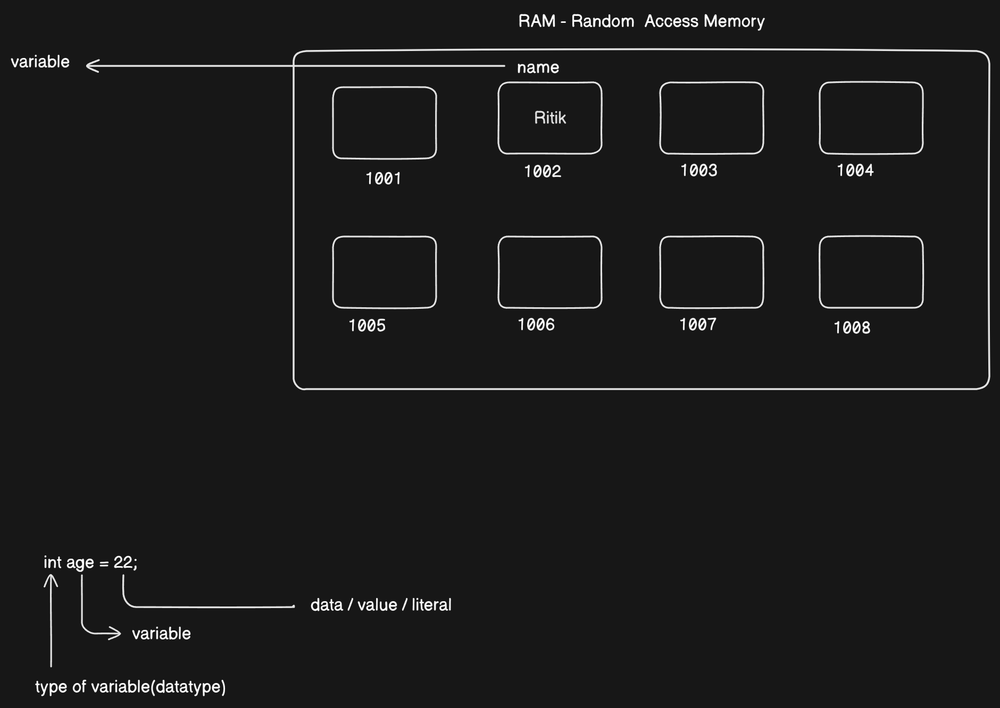

# Variables

**Memory Locations**:  
Variables in a computer program are like **"wells"** where data is stored. These "wells" have names, which are the **variable names**. The purpose of these variables is to **store and retrieve** data efficiently.

---

### Java and Strong Typing

Java is a **strongly typed programming language**, which means that you **must define the type** of each variable before using it. 

### Why is this important?
- In Java, you need to specify the **data type** of a variable at the time of declaration.
- This ensures that the compiler knows what kind of data (like integers, text, etc.) the variable will store and helps avoid errors during the execution.

### Example:
```java
int age = 25;   // 'int' is the data type that stores whole numbers
String name = "John";  // 'String' is the data type that stores text
```




## Operators

Operators are symbols that perform operations on variables and values. In Java, they are categorized into:

1. **Unary Operators**
2. **Binary Operators**
3. **Ternary Operator**

---

### Unary Operators

Work with **one operand** to perform operations like incrementing, negating, etc.

### Examples:

* **Pre-Increment (`++x`)**: Increments before use

  ```java
  int x = 5;
  int y = ++x; // y = 6, x = 6
  ```

* **Post-Increment (`x++`)**: Increments after use

  ```java
  int x = 5;
  int y = x++; // y = 5, x = 6
  ```

* **Unary Minus (`-x`)**: Negates the value

* **Unary Plus (`+x`)**: Indicates a positive value (often implicit)

---

### Binary Operators

Operate on **two operands**. Commonly used for arithmetic, relational, and logical operations.

### Arithmetic Operators:

```java
int result;
result = 5 + 3; // Addition: result = 8
result = 5 - 3; // Subtraction: result = 2
result = 5 * 3; // Multiplication: result = 15
result = 6 / 3; // Division: result = 2
result = 5 % 3; // Modulus: result = 2
```

### Relational Operators:

```java
boolean result;
result = 5 > 3;  // true
result = 5 < 3;  // false
result = 5 >= 5; // true
result = 5 <= 3; // false
result = 5 == 5; // true
result = 5 != 3; // true
```

### Logical Operators:

```java
boolean result;
result = true && false; // Logical AND: false
result = true || false; // Logical OR: true
result = !true;         // Logical NOT: false
```

---

### Ternary Operator

A shorthand for `if-else`, works with **three operands**.

### Syntax:

```java
condition ? value_if_true : value_if_false;
```

### Example:

```java
int age = 18;
String result = (age >= 18) ? "Adult" : "Minor"; // "Adult"
```

If the condition is true, returns "Adult"; otherwise, returns "Minor".

---

## Java Data Types 

###  What are Data Types?

Data types in Java define the type of data that a variable can hold. They specify the size and type of values that can be stored in variables.

Java data types are divided into two broad categories:

1. **Primitive Data Types**
2. **Non-Primitive Data Types**

---

### Primitive Data Types

These are the most basic data types built into the language.

### Integer Types (Sorted by Size)

* **byte**: 1 byte = 8 bits → Range: -128 to 127
* **short**: 2 bytes = 16 bits → Range: -32,768 to 32,767
* **int**: 4 bytes = 32 bits → Range: -2³¹ to 2³¹ - 1
* **long**: 8 bytes = 64 bits → Range: -2⁶³ to 2⁶³ - 1

### Floating Point (Real Number) Types

* **float**: 4 bytes → Approximate precision of 6-7 decimal digits
* **double**: 8 bytes → Approximate precision of 15 decimal digits

> 🔴 **Note**: Real number literals (e.g. `3.14`) are considered `double` by default. To assign them to `float`, either cast or add `f`/`F` suffix.

```java
float num = (float)3.14;
float num = 3.14f;
```

### Other Primitive Types

* **boolean**: 1 bit (conceptual) → Values: `true` or `false`

  * ❌ Cannot participate in type casting
* **char**: 2 bytes → Stores a single Unicode character (e.g., `'A'`, `'a'`)

---

### Non-Primitive Data Types

These are more complex and include:

* **Arrays**
* **Strings** (inbuilt class)
* **Classes** (user-defined)
* **Interfaces**

These types are used for handling objects and complex structures.

---

## Type Casting in Java

Type casting is converting a variable from one data type to another.

### Implicit Casting (Widening Conversion)

* Converts a smaller size type to a larger size type.
* Happens automatically.
* No data loss.

```java
int a = 10;
long b = a;        // int to long
float c = b;       // long to float
```

### Explicit Casting (Narrowing Conversion)

* Converts a larger size type to a smaller size type.
* Requires manual casting.
* Possible data loss.

```java
double a = 10.5;
int b = (int) a;   // double to int, fractional part lost
```

> 🔴 **Note**: Boolean type **cannot** be cast to/from any other type.

---

## Additional Notes

* The **main method** is the entry point of a Java program.

  ```java
  public static void main(String[] args)
  ```
* Execution starts from the JVM, which calls the `main()` method.
* Suffixes:

  * Use `f` or `F` for `float` literals
  * Use `l` or `L` for `long` literals (recommended to use `L` to avoid confusion with `1`)

---

